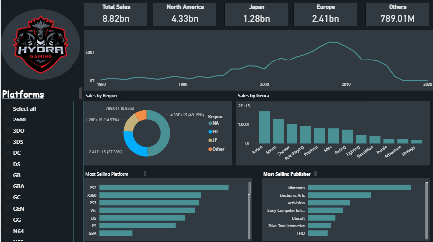
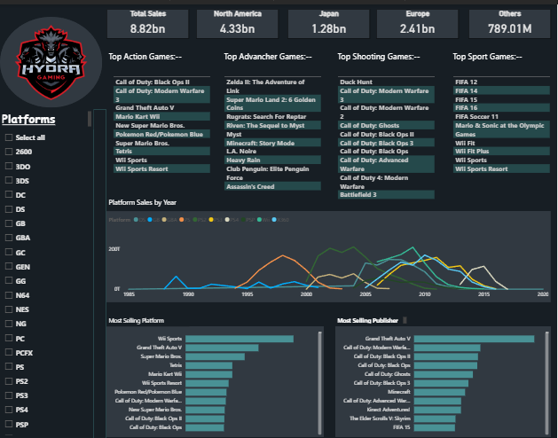

# 🎮 Video Game Sales Dashboard | Power BI

An interactive Power BI dashboard for analyzing global video game sales across platforms, genres, publishers, and regions. This project demonstrates data visualization, data modeling, Power Query transformations, and DAX calculations to generate meaningful business insights.

---

## 📌 Project Overview

The **Video Game Sales Dashboard** is an interactive Business Intelligence project built using **Microsoft Power BI**. It analyzes historical video game sales data to identify sales trends, top-performing games, popular genres, leading publishers, and regional performance.

The dashboard enables users to explore the data through interactive filters and visualizations, making it easy to uncover key insights and support data-driven decision-making.

---

## 🎯 Objectives

- Analyze global video game sales performance.
- Compare sales across different regions.
- Identify top-selling games and publishers.
- Evaluate platform-wise and genre-wise sales.
- Build an interactive dashboard using Power BI.
- Practice data modeling and DAX calculations.

---

## 🛠️ Tools & Technologies

- Microsoft Power BI
- Power Query
- DAX (Data Analysis Expressions)
- Microsoft Excel

---

## 📂 Dataset

The dataset includes information such as:

- Game Name
- Platform
- Genre
- Publisher
- Release Year
- North America Sales
- Europe Sales
- Japan Sales
- Other Sales
- Global Sales

---

## 📊 Dashboard Features

- 📈 Sales Overview
- 🌍 Regional Sales Analysis
- 🎮 Platform-wise Performance
- 🏆 Top Selling Games
- 🏢 Publisher Analysis
- 🎯 Genre Analysis
- 📅 Year-wise Sales Trends
- 🎛 Interactive Slicers & Filters
- 📌 KPI Cards

---

## 📸 Dashboard Preview

> Add your dashboard screenshot below.




---

## 📁 Project Structure

```
Video-Game-Sales-Dashboard/
│
├── Dataset/
│   └── vgsales.csv
│
├── PowerBI/
│   └── Video_Game_Sales_Dashboard.pbix
│
├── Images/
│   └── dashboard.png
│
└── README.md
```

---

## 📈 Key Insights

- Identified the highest-selling gaming platforms.
- Compared sales performance across different regions.
- Analyzed the most popular game genres.
- Evaluated publisher performance based on global sales.
- Visualized yearly sales trends and market distribution.

---

## 🚀 Skills Demonstrated

- Data Cleaning
- Data Transformation
- Data Modeling
- DAX Measures
- Interactive Dashboard Design
- Business Intelligence
- Data Visualization
- Report Development

---

## ▶️ How to Use

1. Clone this repository.
2. Open the `.pbix` file using **Power BI Desktop**.
3. Load or refresh the dataset if required.
4. Explore the dashboard using slicers and filters.

---

## 📚 Learning Outcomes

Through this project, I gained practical experience in:

- Building interactive Power BI dashboards
- Designing business-friendly reports
- Creating DAX measures
- Using Power Query for data transformation
- Developing KPI-based visualizations
- Presenting data-driven insights

---

## 🔮 Future Improvements

- Add drill-through pages
- Create dynamic tooltips
- Implement forecasting visuals
- Connect to SQL databases
- Optimize dashboard performance

---

## 🤝 Acknowledgement

This project was developed as part of my Power BI learning journey to strengthen my data analytics and dashboard development skills. The implementation and customization were completed for educational and portfolio purposes.

---

## 👨‍💻 Author

**Narendra Pittala**

- GitHub: https://github.com/PittalaNarendra14
- LinkedIn: https://www.linkedin.com/in/narendrapittala/

---

⭐ If you found this project helpful, consider giving it a **Star**!
